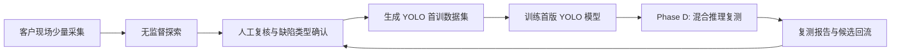

# Phase D：混合推理复测开发说明

本文档给 Claude Code 使用。请按本说明实现 Phase D，不要扩展到 TensorRT 导出、部署打包或相机 SDK 改造。

## 1. 背景与目标

当前项目已经具备：

- Phase A：现场数据对象、缺陷字典、异常复核记录、混合策略基础。
- Phase B：现场交付流程 UI，可完成少量样本采集、异常候选复核、缺陷类型确认。
- Phase C：从现场复核记录生成 YOLO 数据集，并在训练页作为 `field_reviews` 数据源启动首训；训练完成后模型版本会记录 `dataset_version_id` 和 `class_mapping`。

Phase D 要补齐“再次产线复测”环节：选择首训 YOLO 模型和无监督/异常模型，对真实或回放图像进行混合推理，输出 `OK / NG / Suspect / Unknown / Needs Review`，并把未知或需人工确认的样本回流到现场复核队列。

业务位置：



## 2. 范围

本阶段必须实现：

1. 新增混合复测核心服务，能批量处理图像目录或测试输入。
2. 支持选择一个 YOLO 模型版本和一个异常模型占位配置。
3. 调用现有 `core.hybrid_strategy.HybridFusionEngine`，使用 `FusionStrategy.PRODUCTION_RETEST`。
4. 记录复测批次、每张图像的融合结果、模型来源、阈值、耗时和证据摘要。
5. 将 `UNKNOWN`、`NEEDS_REVIEW`、`SUSPECT` 类结果写入 `anomaly_reviews`，供 Phase B 的人工复核继续处理。
6. 新增桌面 UI 页面或在现有生产运行页中增加“混合复测”入口。
7. 补测试，至少覆盖核心融合复测服务、回流逻辑、UI 数据源选择和开始复测入口。

本阶段不做：

- 不做 TensorRT `.engine` 导出和 INT8 校准。
- 不改相机 SDK，不要求真实工业相机联调。
- 不替换现有 `ProductionRunPage` 的生产实时检测能力。
- 不做完整模型评估报表体系，只做复测批次摘要和基础导出。
- 不引入新的数据库框架或大型异步任务框架。

## 3. 关键设计判断

### 3.1 为什么 Phase D 要单独做“混合复测”

现有 `ProductionRunPage` 更像产线实时运行界面，关注相机、采样、编码器位置、NG 事件。Phase D 是首次现场交付闭环中的验证环节，核心问题不是长期生产监控，而是：

- 首版 YOLO 是否覆盖客户真实缺陷。
- 无监督模型是否仍能捕捉 YOLO 未学到的新缺陷。
- 哪些样本需要重新标注并进入下一轮训练。

因此建议新增 `HybridRetestPage`，而不是直接把逻辑塞进生产运行页。

### 3.2 模型配合策略

Phase D 固定使用 `PRODUCTION_RETEST`：

- YOLO 负责已知缺陷类型，命中高置信度则优先判为 `NG`。
- 异常模型负责发现未知缺陷或分布漂移。
- 两者冲突时不强行自动放行，进入 `SUSPECT` 或 `NEEDS_REVIEW`。
- 无 YOLO 命中但异常分高时，进入 `UNKNOWN`，并回流给人工复核。

这符合前面定的“探索优先”路线：首训后仍然保留未知缺陷发现能力。

## 4. 建议文件与接口

### 4.1 新增核心模块

建议新增：

- `core/hybrid_retest.py`
- `tests/test_hybrid_retest.py`

核心数据结构：

```python
@dataclass
class HybridRetestConfig:
    project_id: str
    spec_id: str
    field_session_id: str
    yolo_model_id: str
    anomaly_model_id: str
    image_dir: str
    yolo_conf_threshold: float = 0.5
    anomaly_score_threshold: float = 0.65
    anomaly_high_threshold: float = 0.85
    route_review_statuses: tuple[str, ...] = ("UNKNOWN", "NEEDS_REVIEW", "SUSPECT")
```

```python
@dataclass
class HybridRetestItem:
    image_path: str
    final_decision: str
    reason: str
    yolo_detection_count: int
    anomaly_score: float
    runtime_ms: float
    review_id: str | None = None
```

```python
@dataclass
class HybridRetestResult:
    run_id: str
    total_count: int
    ok_count: int
    ng_count: int
    suspect_count: int
    unknown_count: int
    needs_review_count: int
    items: list[HybridRetestItem]
```

核心函数：

```python
def run_hybrid_retest(
    config: HybridRetestConfig,
    yolo_runner: object | None = None,
    anomaly_runner: object | None = None,
    progress_callback: Callable[[int, int, str], None] | None = None,
) -> HybridRetestResult:
    ...
```

实现要求：

- `image_dir` 只扫描常见图片后缀：`.jpg`, `.jpeg`, `.png`, `.bmp`, `.tif`, `.tiff`。
- runner 可注入，测试中用 fake runner，不依赖真实 YOLO 或 PatchCore。
- 如果 `yolo_runner is None`，先允许退化为空检测结果，便于 UI 和流程测试。
- 如果 `anomaly_runner is None`，先允许退化为低异常分，但要在结果 `reason` 或 `extra` 中标记 `anomaly_unavailable`。
- 对每张图调用 `HybridFusionEngine(FusionConfig(strategy=FusionStrategy.PRODUCTION_RETEST, ...)).fuse(...)`。
- 对 `UNKNOWN / NEEDS_REVIEW / SUSPECT` 写入 `create_anomaly_review(...)`，`review_status` 建议用 `unknown_pending`。
- `notes` 写入 JSON 字符串，包含 `run_id`、`final_decision`、`reason`、`yolo_model_id`、`anomaly_model_id`、`anomaly_score`、`yolo_detection_count`。

### 4.2 数据持久化

优先复用现有表，最小新增：

1. 必须新增 `hybrid_retest_runs` 表。
2. 建议新增 `hybrid_retest_items` 表，方便 UI 列表和后续报告。

在 `core/storage.py` 的 `init_db()` 中增加建表和兼容迁移。

建议字段：

`hybrid_retest_runs`：

- `run_id TEXT PRIMARY KEY`
- `project_id TEXT NOT NULL`
- `spec_id TEXT NOT NULL DEFAULT ''`
- `field_session_id TEXT NOT NULL DEFAULT ''`
- `yolo_model_id TEXT NOT NULL DEFAULT ''`
- `anomaly_model_id TEXT NOT NULL DEFAULT ''`
- `image_dir TEXT NOT NULL DEFAULT ''`
- `config_json TEXT NOT NULL DEFAULT '{}'`
- `summary_json TEXT NOT NULL DEFAULT '{}'`
- `status TEXT NOT NULL DEFAULT 'created'`
- `started_at TEXT`
- `ended_at TEXT`
- `created_at TEXT NOT NULL`
- `updated_at TEXT NOT NULL`

`hybrid_retest_items`：

- `item_id TEXT PRIMARY KEY`
- `run_id TEXT NOT NULL`
- `image_path TEXT NOT NULL`
- `final_decision TEXT NOT NULL`
- `reason TEXT NOT NULL DEFAULT ''`
- `yolo_detection_count INTEGER NOT NULL DEFAULT 0`
- `anomaly_score REAL NOT NULL DEFAULT 0`
- `runtime_ms REAL NOT NULL DEFAULT 0`
- `review_id TEXT`
- `extra_json TEXT NOT NULL DEFAULT '{}'`
- `created_at TEXT NOT NULL`

ID 生成统一使用 `core.id_utils.generate_id()`，不要再直接用纯时间戳作为主键。

### 4.3 UI 页面

建议新增：

- `desktop_app/pages/hybrid_retest_page.py`
- `tests/test_hybrid_retest_page.py`

导航：

- 在 `desktop_app/constants.py` 的 `NAV_ITEMS` 中新增 `hybrid_retest`，位置建议放在 `field_workflow` 后、`production` 前。
- 在 `desktop_app/i18n.py` 增加中英文文案。
- 在 `desktop_app/main_window.py` 注册页面。

UI 必须有以下控件：

- YOLO 模型下拉框：只列当前项目下 `model_type == "yolo"` 且有 `model_path` 的模型版本，优先显示 `active/completed`。
- 异常模型下拉框：本阶段可以支持占位项，例如 `No anomaly model / Stub anomaly score`，但 UI 上要明确展示当前异常模型状态。
- 图片目录选择。
- 阈值控件：`yolo_conf_threshold`、`anomaly_score_threshold`、`anomaly_high_threshold`。
- 开始复测、停止复测、刷新模型。
- 汇总区：总数、OK、NG、Suspect、Unknown、Needs Review、回流复核数。
- 结果表：图片、最终判定、原因、YOLO 检测数、异常分、耗时、复核 ID。

交互要求：

- 未选择项目时禁用开始复测，并提示选择项目。
- 未选择 YOLO 模型时不允许开始。
- 图片目录不存在或无图片时不允许开始。
- 复测运行中禁用输入控件，结束或失败后恢复。
- 点击 `UNKNOWN / NEEDS_REVIEW / SUSPECT` 行时，可以显示对应 `review_id`，方便后续回到现场复核页处理。

### 4.4 Worker

建议新增：

- `desktop_app/workers/hybrid_retest_worker.py`

要求：

- 继承 `QThread`。
- 接收 `HybridRetestConfig`。
- 发出 `progress(current, total, image_path)`、`item_done(dict)`、`finished(result)`、`error(str)`。
- 测试中不要启动真实模型推理，核心服务支持 runner 注入即可。

### 4.5 模型 runner 适配

本阶段只需要保持可插拔接口：

YOLO runner 期望输出：

```python
class YoloLikeRunner:
    runner_name: str

    def predict_image(self, image_path: str) -> object:
        ...
```

`predict_image()` 返回对象上应有 `detections`，每个 detection 能转换为 `BBoxPrediction`：

- `class_name`
- `confidence`
- `bbox_xyxy`

异常 runner 期望输出：

```python
class AnomalyLikeRunner:
    runner_name: str

    def predict_image(self, image_path: str) -> object:
        ...
```

返回对象至少能提供：

- `image_score`
- 可选 `heatmap_path`

如果当前项目已有 PatchCore runner 还没完整实现，不要强行接真实训练/推理。先用适配层和 fake runner 把流程闭环做出来。

## 5. 回流到人工复核的规则

当融合结果为以下任一状态时，创建 `anomaly_reviews`：

- `UNKNOWN`
- `NEEDS_REVIEW`
- `SUSPECT`

字段建议：

- `field_session_id`：来自本次 `HybridRetestConfig.field_session_id`。如果 UI 没有显式选择，则自动创建一个 `session_type="production_retest"` 的 `FieldSession`。
- `image_path`：当前复测图片路径。
- `anomaly_score`：融合结果中的异常分。
- `review_status`：`unknown_pending`。
- `notes`：JSON，包含复测上下文。

不要把明确 `OK` 回流。

`NG` 是否回流：

- 默认不回流，因为 YOLO 已经识别为已知缺陷。
- 但 `NG` 结果必须写入 `hybrid_retest_items`，后续报告需要统计。

## 6. 验收标准

必须满足：

1. 可以从 UI 选择 YOLO 模型、图片目录、阈值并启动混合复测。
2. 复测完成后 UI 显示 OK/NG/Suspect/Unknown/Needs Review 统计。
3. `UNKNOWN / NEEDS_REVIEW / SUSPECT` 自动出现在 `anomaly_reviews` 中，状态为 `unknown_pending`。
4. `run_hybrid_retest()` 可用 fake runner 在测试中稳定运行。
5. 模型和阈值信息写入复测批次记录，后续可追溯。
6. 不破坏现有 Phase A/B/C 流程。

## 7. 测试要求

新增或更新测试：

- `tests/test_hybrid_retest.py`
  - 空目录报错或返回明确失败。
  - fake YOLO 高置信命中时输出 `NG`。
  - fake anomaly 高分且 YOLO 无命中时输出 `UNKNOWN` 并创建 `anomaly_review`。
  - 中等异常分输出 `NEEDS_REVIEW` 并创建 `anomaly_review`。
  - 低异常分且 YOLO 无命中输出 `OK`，不创建复核记录。
  - `run_id`、summary、item 记录能从数据库读取。

- `tests/test_hybrid_retest_page.py`
  - 页面可实例化。
  - 当前项目模型能出现在 YOLO 模型下拉框。
  - 未选模型/目录时开始按钮路径有保护。
  - worker 可 monkeypatch 后验证开始复测会传入正确 config。

- 回归测试：
  - Phase A/B/C 相关测试必须继续通过。

建议执行命令：

```powershell
.\.venv\Scripts\python.exe -m pytest tests\test_hybrid_retest.py tests\test_hybrid_retest_page.py -q
.\.venv\Scripts\python.exe -m pytest tests\test_field_session.py tests\test_defect_dictionary.py tests\test_anomaly_review.py tests\test_field_workflow_page.py tests\test_field_training_dataset.py tests\test_field_workflow_training_integration.py tests\test_training_page.py tests\test_hybrid_strategy.py -q
.\.venv\Scripts\python.exe -m ruff check core\hybrid_retest.py desktop_app\pages\hybrid_retest_page.py desktop_app\workers\hybrid_retest_worker.py tests\test_hybrid_retest.py tests\test_hybrid_retest_page.py
.\.venv\Scripts\python.exe -m pytest -q
```

## 8. 开发顺序

建议按以下顺序提交实现，但不要自动 `git commit`：

1. `core/storage.py` 增加复测批次和复测明细表。
2. `core/hybrid_retest.py` 实现核心服务和 fake runner 可测路径。
3. 补 `tests/test_hybrid_retest.py`。
4. 新增 `desktop_app/workers/hybrid_retest_worker.py`。
5. 新增 `desktop_app/pages/hybrid_retest_page.py`。
6. 注册导航和 i18n。
7. 补 `tests/test_hybrid_retest_page.py`。
8. 跑全量测试，修复回归。

## 9. 注意事项

- 不要引入网络下载模型的逻辑。
- 不要在测试中依赖 CUDA、Ultralytics 或真实图片模型。
- 不要删除现有页面或改动 Phase B/C 的核心行为。
- 所有新文件使用 UTF-8。
- 中文文案要能被 `tests/test_source_encoding.py` 检查通过。
- 不要把 `.pt` 自动转换成 TensorRT `.engine`。TensorRT 是 Phase E 的内容。

## 10. 与 Phase E 的边界

Phase D 产出的是“复测闭环能力”：模型组合、融合判定、人工回流、复测追溯。

Phase E 再处理：

- TensorRT 导出。
- `.pt / .onnx / .engine` 运行后端选择。
- FP16/INT8 benchmark。
- 产线部署包。
- GPU 显存和吞吐压测。

Phase D 的数据结构里可以保留 `model_runtime_backend` 或 `engine_path` 字段的扩展空间，但不要在本阶段实现转换流程。
